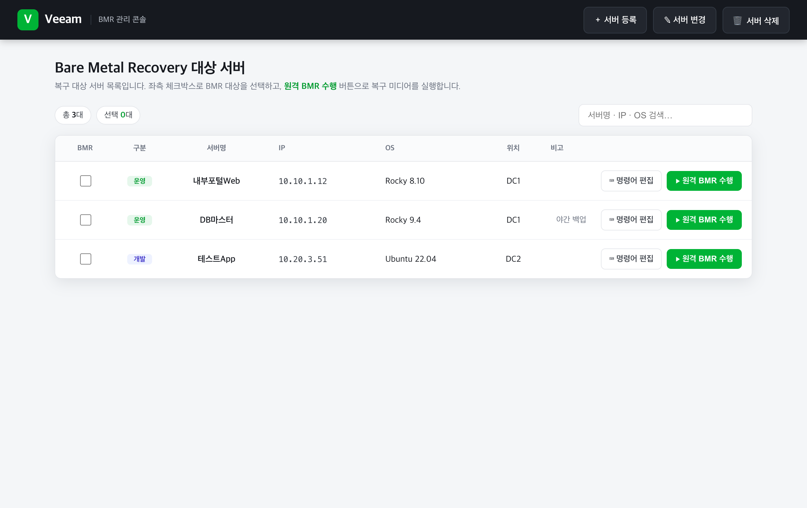
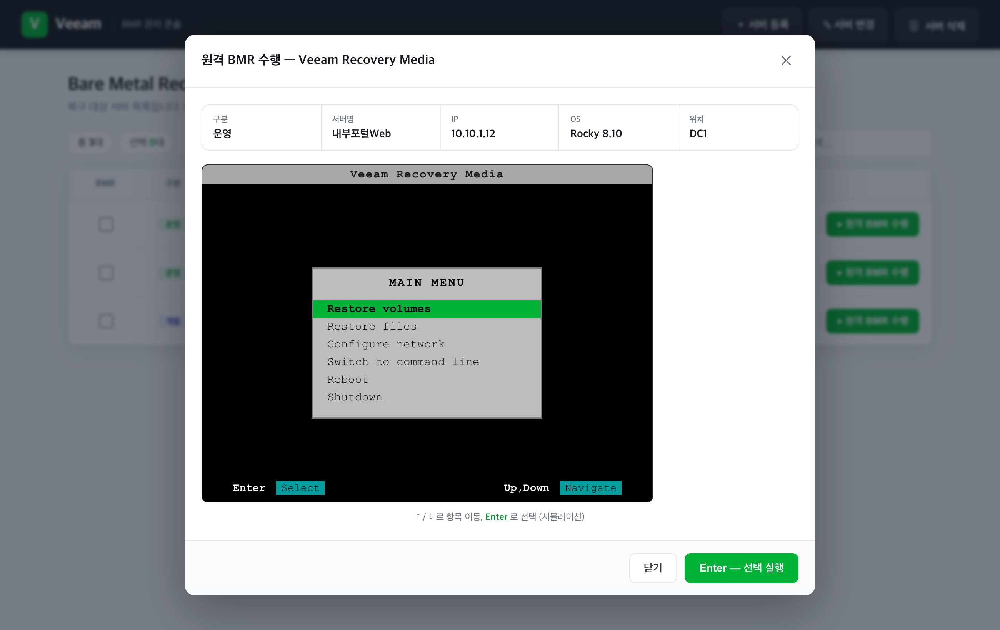

# Veeam BMR 관리 콘솔

Node.js 로컬 웹서버 기반 BMR(Bare Metal Recovery) 관리 콘솔입니다.
**외부 의존성이 없습니다** — Node 내장 모듈만 사용하므로 `npm install` 이 필요 없습니다.

## 화면

### 메인 — BMR 대상 서버 목록


### 원격 BMR 수행 팝업 (Veeam Recovery Media)


## 폴더 구조
```
BMR Portal/
├─ server.js           # 로컬 웹서버 + REST API (의존성 없음)
├─ package.json
├─ json/
│  └─ servers.json     # 서버 데이터 (JSON 저장소)
├─ public/
│  ├─ index.html
│  ├─ styles.css       # Veeam 브랜드(그린) 톤 UI
│  └─ app.js
└─ docs/               # README 캡처 이미지
   ├─ main.png
   └─ bmr-popup.png
```

## 실행 방법
1. Node.js 설치 (설치되어 있지 않다면):
   ```bash
   brew install node
   ```
   또는 https://nodejs.org 에서 LTS 버전 설치.

2. 서버 실행:
   ```bash
   node server.js
   ```

3. 브라우저에서 접속:  http://localhost:3000

## 기능
- **첫 화면**: BMR 대상 서버 목록 (BMR 구분 체크박스 · 서버명 · IP · OS · 위치 · 비고)
- **상단 메뉴**: 서버 등록 / 변경 / 삭제 → 클릭 시 팝업으로 처리
- **원격 BMR 수행 버튼**: 팝업으로 해당 서버 정보 요약 + Veeam Recovery Media 부팅 화면 표시
  - ↑/↓ 로 메뉴 이동, Enter 로 선택 (시뮬레이션)
- 모든 데이터는 `json/servers.json` 에 JSON 형식으로 자동 저장

## API
| 메서드 | 경로 | 설명 |
|--------|------|------|
| GET | `/api/servers` | 서버 목록 조회 |
| POST | `/api/servers` | 서버 등록 |
| PUT | `/api/servers/:id` | 서버 변경 |
| DELETE | `/api/servers/:id` | 서버 삭제 |
